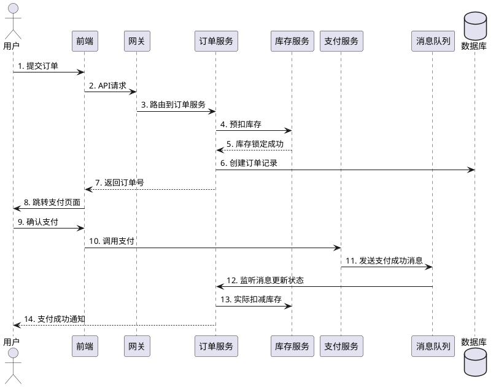
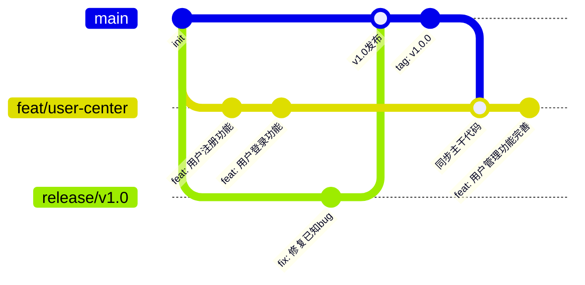

# **Java项目架构与功能点总结文档格式与要求**

## **一、文档整体结构**

### **封面页**
```
项目名称：[项目全称]
项目代号：[如有]
版本号：[v1.0.0]
文档版本：[v1.0]
编写部门：[技术部/架构组]
编写人：[姓名]
审核人：[姓名]
发布日期：[YYYY-MM-DD]
保密级别：[公开/内部/机密]
```

### **修订记录**
| 版本 | 修订日期 | 修订人 | 修订说明 |
|------|----------|--------|----------|
| v1.0 | 2024-01-01 | 张三 | 初始版本 |
| v1.1 | 2024-01-15 | 李四 | 补充性能指标 |

## **二、项目概览部分**

### **1. 项目摘要**
```markdown
### 1.1 项目背景
- 业务驱动力：解决什么问题？满足什么需求？
- 行业背景：所在行业现状与发展趋势
- 战略意义：对公司/业务的价值贡献

### 1.2 项目目标
#### 业务目标：
- 短期目标（3个月）：
  - 目标1：支持百万级用户同时在线
  - 目标2：日均交易量达到XX万笔
- 中期目标（1年）：
  - 目标1：系统可用性达到99.99%
  - 目标2：支持千亿级数据存储
- 长期目标（3年）：
  - 目标1：成为行业标杆系统
  - 目标2：支持国际化部署

#### 技术目标：
- 架构目标：高可用、高并发、易扩展
- 性能目标：响应时间<200ms，TPS>10000
- 质量目标：代码覆盖率>80%，线上缺陷率<0.1%

### 1.3 项目范围
#### 包含范围：
- 功能范围：[列出主要功能模块]
- 用户范围：[C端用户/B端用户/管理端]
- 数据范围：[数据类型、数据量预估]

#### 排除范围：
- 不包含：第三方支付对接（二期）
- 不包含：大数据分析模块（单独项目）
- 不包含：移动端App开发（独立团队）

### 1.4 关键成功指标（KSI）
| 指标类别 | 具体指标 | 目标值 | 测量方式 |
|----------|----------|--------|----------|
| 性能指标 | 平均响应时间 | <200ms | 监控系统 |
| 可用性指标 | 系统可用性 | 99.99% | SLI/SLO |
| 业务指标 | 日活跃用户 | 100万 | 数据埋点 |
| 质量指标 | 线上缺陷密度 | <1个/千行 | 缺陷管理系统 |
```

## **三、架构设计部分**

### **2. 总体架构**
```markdown
### 2.1 架构设计原则
1. **高内聚低耦合**：模块化设计，职责清晰
2. **扩展性优先**：支持水平扩展，无单点瓶颈
3. **可观测性**：完善的监控、日志、链路追踪
4. **安全性**：纵深防御，最小权限原则
5. **成本控制**：资源按需分配，避免过度设计

### 2.2 架构图
#### 2.2.1 逻辑架构图
[插入逻辑架构图]
描述：
- 表现层：Web前端、移动端、开放API
- 应用层：业务服务、网关、任务调度
- 领域层：核心业务领域模型
- 基础设施层：数据库、缓存、消息队列

#### 2.2.2 物理架构图
[插入物理部署图]
描述：
- 前端集群：Nginx + CDN
- 应用集群：K8s Pod + Service
- 数据层：主从库 + 分片集群
- 中间件：Redis Cluster + Kafka集群

#### 2.2.3 数据流架构图
[插入数据流程图]
描述：
- 请求流向：用户 -> 网关 -> 服务 -> 数据库
- 数据同步：CDC -> Kafka -> 数据仓库
- 缓存策略：读写策略、更新策略

### 2.3 技术选型
#### 后端技术栈：
| 技术领域 | 选型 | 版本 | 选型理由 | 备选方案 |
|----------|------|------|----------|----------|
| 开发框架 | Spring Boot | 2.7.x | 生态成熟，开发效率高 | Quarkus |
| 微服务框架 | Spring Cloud | 2021.x | 与Spring Boot无缝集成 | Dubbo |
| 网关 | Spring Cloud Gateway | 3.1.x | 响应式编程，性能好 | Zuul 2 |
| 服务注册 | Nacos | 2.1.x | AP/CP可切换，功能全面 | Eureka |
| 配置中心 | Nacos | 2.1.x | 统一管理，减少组件 | Apollo |
| 认证授权 | Spring Security + OAuth2 | 5.7.x | 标准协议，安全性高 | Keycloak |
| 消息队列 | Kafka | 3.3.x | 高吞吐，分布式 | RocketMQ |
| 缓存 | Redis | 6.2.x | 数据结构丰富，性能好 | Couchbase |
| 数据库 | MySQL | 8.0.x | 生态完善，工具多 | PostgreSQL |
| 搜索引擎 | Elasticsearch | 8.5.x | 全文检索，聚合分析 | OpenSearch |
| 任务调度 | XXL-Job | 2.4.x | 分布式，可视化管理 | Elastic-Job |
| 监控 | Prometheus + Grafana | 2.40+ | 生态完善，社区活跃 | SkyWalking |
| 链路追踪 | Jaeger | 1.40.x | CNCF项目，云原生 | Zipkin |

#### 前端技术栈：
| 技术领域 | 选型 | 版本 | 选型理由 |
|----------|------|------|----------|
| 前端框架 | Vue 3 | 3.2.x | 渐进式，生态丰富 |
| 构建工具 | Vite | 4.0.x | 开发体验好，构建快 |
| UI框架 | Element Plus | 2.3.x | 组件丰富，设计规范 |
| 状态管理 | Pinia | 2.0.x | Vue 3官方推荐 |
| 路由 | Vue Router | 4.1.x | 官方路由，稳定 |
| HTTP客户端 | Axios | 1.3.x | 拦截器完善，使用广泛 |

#### 基础设施：
| 类别 | 技术选型 | 说明 |
|------|----------|------|
| 容器化 | Docker + K8s | 微服务部署标准 |
| 服务网格 | Istio | 服务治理，流量管理 |
| CI/CD | Jenkins + ArgoCD | 自动化部署 |
| 日志系统 | ELK Stack | 集中日志管理 |
| 代码管理 | GitLab | 代码托管 + CI |
| 制品仓库 | Nexus | Maven私有仓库 |
```

## **四、核心功能模块**

### **3. 功能架构**
```markdown
### 3.1 功能模块划分
┌─────────────────────────────────────────────────┐
│                  用户端功能模块                    │
├─────────────────────────────────────────────────┤
│ 1. 用户中心模块                                   │
│    - 注册登录（多方式）                           │
│    - 个人资料管理                                 │
│    - 安全中心（绑定、风控）                       │
│ 2. 订单交易模块                                   │
│    - 商品浏览与搜索                               │
│    - 购物车管理                                   │
│    - 订单创建与支付                               │
│    - 订单状态跟踪                                 │
│ 3. 内容管理模块                                   │
│    - 内容发布与编辑                               │
│    - 评论与互动                                   │
│    - 内容推荐引擎                                 │
│ 4. 消息通知模块                                   │
│    - 站内信                                       │
│    - 推送通知                                     │
│    - 邮件/SMS通知                                 │
└─────────────────────────────────────────────────┘

┌─────────────────────────────────────────────────┐
│                  管理端功能模块                    │
├─────────────────────────────────────────────────┤
│ 1. 系统管理模块                                   │
│    - 用户权限管理（RBAC）                         │
│    - 角色与菜单配置                               │
│    - 操作日志审计                                 │
│ 2. 数据管理模块                                   │
│    - 业务数据看板                                 │
│    - 数据导出导入                                 │
│    - 数据统计分析                                 │
│ 3. 监控告警模块                                   │
│    - 系统健康检查                                 │
│    - 性能监控大盘                                 │
│    - 告警规则配置                                 │
│ 4. 运维管理模块                                   │
│    - 配置中心管理                                 │
│    - 服务治理管理                                 │
│    - 发布部署管理                                 │
└─────────────────────────────────────────────────┘

### 3.2 功能详细说明
#### 模块1：用户中心服务
**功能点：**
1. **用户注册**
   - 功能描述：支持手机号、邮箱、第三方登录注册
   - 业务流程：验证 → 创建 → 初始化 → 返回结果
   - 技术实现：JWT令牌、验证码服务、防重放攻击
   - 性能要求：注册成功率达99.9%，响应时间<500ms

2. **登录认证**
   - 功能描述：多因素认证、单点登录、会话管理
   - 安全措施：密码加密存储、登录失败锁定、异地登录提醒
   - 扩展能力：支持OAuth2.0、SAML等标准协议

3. **个人资料管理**
   - 数据模型：用户基础信息、扩展属性、偏好设置
   - 更新策略：实时更新+异步同步到其他系统
   - 数据校验：前端校验+后端校验+数据库约束

#### 模块2：订单交易服务
**功能点：**
1. **商品服务**
   - 商品SKU管理：支持多规格、多价格
   - 库存管理：实时库存、预扣库存、安全库存
   - 商品搜索：Elasticsearch全文检索+筛选排序

2. **购物车服务**
   - 数据结构：Redis Hash存储，TTL 7天
   - 并发控制：乐观锁防止超卖
   - 合并策略：登录后合并匿名购物车

3. **订单服务**
   - 状态机：待付款→已付款→待发货→已发货→已完成
   - 分布式事务：Seata AT模式保证一致性
   - 订单拆分：支持分仓库、分商家拆单

4. **支付服务**
   - 支付渠道：微信支付、支付宝、银联
   - 对账流程：自动对账+手动补单
   - 风控规则：金额限制、频率限制、黑名单
```

## **五、核心业务流程**

### **4. 关键业务流程**
```markdown
### 4.1 核心业务流程
#### 流程一：用户下单支付流程


**流程说明：**
1. **前端提交**：用户在前端提交订单，携带商品信息、收货地址等
2. **网关路由**：网关鉴权后路由到对应服务
3. **库存预扣**：使用分布式锁保证库存一致性
4. **订单创建**：生成唯一订单号，保存到数据库
5. **支付调用**：调用第三方支付渠道
6. **异步通知**：支付成功后通过MQ通知各服务
7. **状态同步**：更新订单状态，实际扣减库存
8. **结果通知**：通过WebSocket/Push通知用户

**关键设计：**
- 幂等性设计：订单号唯一，防止重复提交
- 最终一致性：通过MQ实现异步状态同步
- 补偿机制：库存预扣超时自动释放

#### 流程二：数据同步流程
**场景**：业务数据同步到数据仓库
```yaml
数据流向:
  业务库(MySQL) 
    → Debezium(CDC) 
    → Kafka 
    → Flink(ETL) 
    → 数据仓库(Hive)
    → 数据湖(Iceberg)
    → 分析引擎(Presto)

技术要点:
  1. CDC实时捕获：基于MySQL binlog
  2. 数据格式：Avro序列化，Schema Registry管理
  3. 流处理：Flink SQL进行数据清洗转换
  4. 数据分层：ODS → DWD → DWS → ADS
  5. 数据质量：数据稽核、血缘分析
```

## **六、非功能需求**

### **5. 性能与质量**
```markdown
### 5.1 性能指标
#### 响应时间要求：
| 操作类型 | P50 | P95 | P99 | 测量条件 |
|----------|-----|-----|-----|----------|
| 页面加载 | <1s | <2s | <3s | 4M带宽 |
| API接口 | <100ms | <200ms | <500ms | 100并发 |
| 复杂查询 | <2s | <5s | <10s | 百万数据 |
| 数据导出 | <30s | <60s | <120s | 10万行 |

#### 吞吐量要求：
| 场景 | 目标TPS | 峰值TPS | 数据量 |
|------|---------|---------|--------|
| 用户登录 | 5000 | 10000 | 100万用户 |
| 订单创建 | 2000 | 5000 | 日均10万单 |
| 支付请求 | 1000 | 3000 | 支付成功率99% |
| 消息推送 | 10000 | 20000 | 实时性<1s |

### 5.2 可用性要求
#### SLA指标：
| 服务级别 | 目标值 | 计算公式 | 监控方式 |
|----------|--------|----------|----------|
| 系统可用性 | 99.99% | (总时长-故障时长)/总时长 | Prometheus |
| 服务成功率 | 99.9% | 成功请求/总请求 | 网关日志 |
| 数据一致性 | 99.999% | 一致副本数/总副本数 | 定期校验 |
| 容灾RTO | <5分钟 | 故障恢复时间 | 演练测试 |
| 容灾RPO | <1分钟 | 数据丢失时间 | 备份恢复 |

### 5.3 安全性要求
#### 安全层级：
1. **网络安全**：
   - WAF防护：SQL注入、XSS攻击防护
   - DDoS防护：流量清洗，自动封禁
   - 网络隔离：VPC、安全组、白名单

2. **应用安全**：
   - 输入校验：前后端双重校验
   - 权限控制：RBAC + 数据权限
   - 会话安全：Token刷新、防劫持

3. **数据安全**：
   - 加密存储：敏感数据AES加密
   - 传输加密：TLS 1.3+ 
   - 数据脱敏：日志、监控数据脱敏

4. **审计安全**：
   - 操作日志：关键操作全记录
   - 访问日志：保留180天
   - 安全审计：定期渗透测试
```

## **七、部署与运维**

### **6. 部署架构**
```markdown
### 6.1 环境规划
| 环境 | 服务器配置 | 数量 | 用途 | 数据隔离 |
|------|------------|------|------|----------|
| 开发环境 | 4C8G | 5台 | 功能开发测试 | 共享数据库 |
| 测试环境 | 8C16G | 8台 | 集成测试、性能测试 | 独立数据库 |
| 预发环境 | 16C32G | 10台 | 生产仿真 | 生产数据脱敏 |
| 生产环境 | 32C64G | 动态扩展 | 线上服务 | 独立集群 |

### 6.2 部署拓扑
```
生产环境部署图：
┌─────────────────────────────────────────────────────────┐
│                   负载均衡层 (SLB/ELB)                    │
├─────────────────────────────────────────────────────────┤
│                    网关集群 (K8s Service)                 │
│                   ┌──────┐ ┌──────┐ ┌──────┐            │
│                   │ Pod  │ │ Pod  │ │ Pod  │ × 10       │
│                   └──────┘ └──────┘ └──────┘            │
├─────────────────────────────────────────────────────────┤
│                    业务服务层 (K8s Deployment)            │
│  ┌─────────┐ ┌─────────┐ ┌─────────┐ ┌─────────┐        │
│  │用户服务 │ │订单服务 │ │支付服务 │ │商品服务 │ ...    │
│  │ 3 Pods │ │ 5 Pods │ │ 3 Pods │ │ 4 Pods │        │
│  └─────────┘ └─────────┘ └─────────┘ └─────────┘        │
├─────────────────────────────────────────────────────────┤
│                     中间件层                              │
│   ┌─────┐    ┌─────┐    ┌─────┐    ┌─────┐              │
│   │Redis│    │ Kafka│    │MySQL│    │ES   │ 集群模式    │
│   │集群 │    │ 集群 │    │集群 │    │集群 │              │
│   └─────┘    └─────┘    └─────┘    └─────┘              │
└─────────────────────────────────────────────────────────┘
```

### 6.3 监控体系
#### 监控维度：
1. **基础设施监控**：
   - 服务器：CPU、内存、磁盘、网络
   - 容器：Pod状态、资源使用、重启次数
   - 中间件：连接数、队列深度、响应时间

2. **应用性能监控**：
   - JVM监控：堆内存、GC情况、线程状态
   - 接口监控：响应时间、成功率、调用链
   - 业务监控：关键业务指标、业务漏斗

3. **日志监控**：
   - 错误日志：实时告警，自动聚合
   - 访问日志：分析用户行为，优化体验
   - 审计日志：安全合规，追溯分析

#### 告警策略：
| 级别 | 条件 | 通知方式 | 响应时间 |
|------|------|----------|----------|
| P0 | 核心服务不可用 | 电话+短信+钉钉 | 5分钟内 |
| P1 | 重要功能异常 | 钉钉+邮件 | 15分钟内 |
| P2 | 性能指标异常 | 钉钉 | 1小时内 |
| P3 | 一般性异常 | 邮件 | 4小时内 |
```

## **八、项目管理与质量**

### **7. 开发规范**
```markdown
### 7.1 代码规范
#### Java代码规范：
```java
// 1. 包命名规范
com.company.project.module.submodule
// 示例：com.example.order.service.impl

// 2. 类命名规范
// 接口：XxxService
// 实现类：XxxServiceImpl
// 实体类：XxxEntity / XxxDTO / XxxVO
// 枚举：XxxEnum
// 异常：XxxException
// 配置类：XxxConfiguration
// 常量类：XxxConstants

// 3. 方法命名规范
// 查询：getXxx, findXxx, queryXxx
// 新增：createXxx, addXxx, insertXxx
// 更新：updateXxx, modifyXxx
// 删除：deleteXxx, removeXxx
// 条件：byId, byName, withCondition

// 4. 代码质量要求
// 圈复杂度：< 15
// 方法长度：< 50行
// 类长度：< 500行
// 测试覆盖率：> 80%
```

#### 数据库设计规范：
```sql
-- 1. 表命名规范
-- 业务表：t_biz_[业务名]
-- 关系表：t_rel_[关系名]
-- 配置表：t_cfg_[配置名]
-- 日志表：t_log_[日志类型]
-- 示例：t_biz_order, t_rel_order_item

-- 2. 字段规范
-- 主键：id BIGINT UNSIGNED AUTO_INCREMENT
-- 时间：gmt_create DATETIME DEFAULT CURRENT_TIMESTAMP
-- 软删除：is_deleted TINYINT DEFAULT 0
-- 状态字段：status TINYINT COMMENT '状态：0-无效，1-有效'

-- 3. 索引规范
-- 主键索引：PRIMARY KEY (id)
-- 唯一索引：UNIQUE KEY uk_[字段名] ([字段名])
-- 普通索引：KEY idx_[字段名] ([字段名])
-- 组合索引：KEY idx_[字段1]_[字段2] ([字段1], [字段2])
```

### 7.2 分支管理策略


### 7.3 质量门禁
| 检查点 | 检查工具 | 合格标准 | 阻断发布 |
|--------|----------|----------|----------|
| 代码规范 | CheckStyle | 0个严重问题 | 是 |
| 静态分析 | SonarQube | A级评分 | 是 |
| 单元测试 | JaCoCo | 行覆盖>80% | 是 |
| 集成测试 | 自动化测试 | 通过率100% | 是 |
| 安全扫描 | DependencyCheck | 无高危漏洞 | 是 |
| 性能测试 | JMeter | 响应时间达标 | 是 |
```

## **九、项目成果与评估**

### **8. 成果指标**
```markdown
### 8.1 技术成果
#### 架构创新点：
1. **微服务治理体系**：统一的服务治理平台，降低运维成本30%
2. **可观测性平台**：全链路监控，故障定位时间减少70%
3. **自动化流水线**：CI/CD全流程自动化，发布效率提升200%

#### 性能提升：
- 系统吞吐量：从1000 TPS提升到10000 TPS
- 平均响应时间：从500ms降低到100ms
- 系统可用性：从99.9%提升到99.99%

#### 成本优化：
- 服务器资源：通过容器化节省40%资源
- 数据库成本：分库分表减少50%硬件投入
- 运维成本：自动化运维减少60%人力投入

### 8.2 业务成果
#### 用户增长：
- 注册用户数：从10万增长到500万
- 日活跃用户：从1万增长到50万
- 用户留存率：从30%提升到60%

#### 业务指标：
- 订单量：日均订单从1万增长到10万
- GMV：月交易额从1000万增长到1亿
- 转化率：从2%提升到5%

### 8.3 团队成长
#### 能力提升：
- 技术栈：团队掌握云原生技术栈
- 工程能力：代码质量和开发效率显著提升
- 协作能力：形成标准化的开发协作流程

#### 知识沉淀：
- 技术文档：累计编写500+技术文档
- 代码库：沉淀可复用组件库和工具包
- 最佳实践：总结各领域最佳实践方案
```

## **十、总结与展望**

### **9. 经验总结**
```markdown
### 9.1 成功经验
1. **架构设计方面**：
   - 提前做好技术选型和架构设计
   - 坚持架构原则，避免技术债务
   - 建立完善的技术评审机制

2. **开发过程方面**：
   - 严格执行代码规范和review流程
   - 重视自动化测试和质量门禁
   - 持续重构，保持代码健康度

3. **团队协作方面**：
   - 建立高效的沟通协作机制
   - 知识共享，避免知识孤岛
   - 定期复盘，持续改进

### 9.2 教训反思
1. **技术决策方面**：
   - 过早引入新技术导致的学习成本
   - 对第三方组件依赖过深的风险
   - 性能压测不充分导致的生产问题

2. **项目管理方面**：
   - 需求变更管理不够严格
   - 技术债务的累积和治理
   - 团队技术能力的差异化问题

### 9.3 改进措施
1. **技术管理**：
   - 建立更完善的技术雷达
   - 加强新技术评估和试点
   - 建立技术债务偿还机制

2. **过程改进**：
   - 优化需求评审和变更流程
   - 加强技术文档的管理和维护
   - 建立更完善的知识管理体系
```

### **10. 未来规划**
```markdown
### 10.1 技术演进路线
#### 短期（未来6个月）：
- 微服务架构升级：服务网格化改造
- 数据库优化：TiDB引入，解决分片问题
- 中间件升级：消息队列、缓存集群优化

#### 中期（未来1年）：
- 云原生深化：全面Serverless化
- AI能力引入：智能推荐、智能客服
- 大数据平台：实时数仓、用户画像

#### 长期（未来2-3年）：
- 技术中台建设：能力沉淀和开放
- 国际化架构：多地域、多语言支持
- 技术生态：开源贡献，技术影响力

### 10.2 业务发展规划
#### 功能扩展：
- 第一阶段：核心功能完善，用户体验优化
- 第二阶段：生态建设，第三方接入
- 第三阶段：平台化，开放API能力

#### 业务创新：
- 商业模式创新：会员体系、增值服务
- 用户体验创新：个性化推荐、智能交互
- 生态建设：上下游整合，构建生态圈
```

## **十一、附录**

### **A. 术语表**
| 术语 | 英文 | 解释 |
|------|------|------|
| TPS | Transactions Per Second | 每秒事务处理量 |
| SLA | Service Level Agreement | 服务等级协议 |
| RTO | Recovery Time Objective | 恢复时间目标 |
| RPO | Recovery Point Objective | 恢复点目标 |
| APM | Application Performance Monitoring | 应用性能监控 |
| CDC | Change Data Capture | 变更数据捕获 |
| DDD | Domain-Driven Design | 领域驱动设计 |

### **B. 参考文档**
- [架构设计文档链接]
- [数据库设计文档链接]
- [接口文档链接]
- [部署文档链接]
- [运维手册链接]

### **C. 相关系统**
| 系统名称 | 关系 | 交互方式 | 负责人 |
|----------|------|----------|--------|
| 用户中心系统 | 上游系统 | HTTP API | 张三 |
| 支付系统 | 下游系统 | 消息队列 | 李四 |
| 风控系统 | 协同系统 | RPC调用 | 王五 |
| 数据平台 | 数据消费 | 数据同步 | 赵六 |

---

## **文档编写要求**

### **1. 内容要求**
- **准确性**：所有技术细节必须准确无误
- **完整性**：覆盖架构设计的各个方面
- **可读性**：结构清晰，层次分明，语言简洁
- **实用性**：包含可操作的指导和建议
- **前瞻性**：考虑未来的扩展和演进

### **2. 格式要求**
- **统一模板**：使用统一的文档模板
- **图表规范**：图表清晰，有编号和标题
- **版本控制**：文档纳入版本管理系统
- **定期更新**：至少每季度更新一次
- **多人协作**：支持多人协同编辑和评审

### **3. 评审要求**
- **技术评审**：由架构师和技术专家评审
- **业务评审**：由产品经理和业务方评审
- **安全评审**：由安全团队进行安全评估
- **运维评审**：由运维团队评估可运维性

### **4. 维护要求**
- **变更管理**：文档变更需要走审批流程
- **知识传承**：新成员必须阅读核心文档
- **归档管理**：历史版本妥善保存
- **定期审计**：每半年进行一次文档审计

**文档状态**：[✓] 草稿 [ ] 评审中 [ ] 已批准 [ ] 已归档

**下一步行动**：
1. 组织技术评审会议（预计时间：XXX）
2. 根据评审意见修改文档
3. 发布正式版本并通知相关人员
4. 安排知识分享和培训
